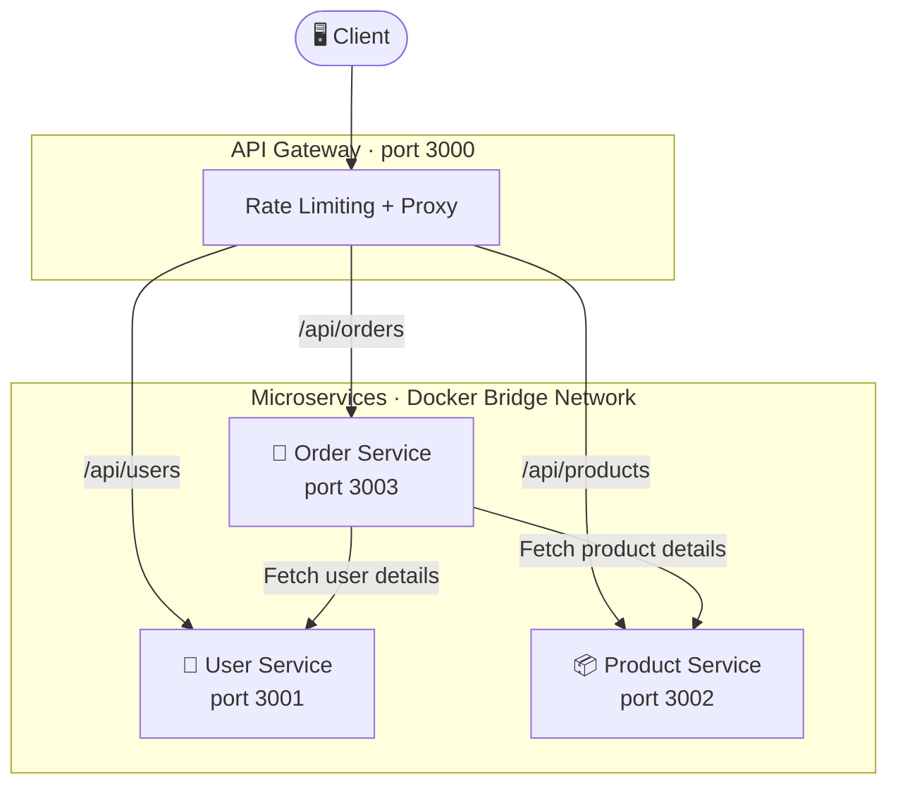

# 🐳 Docker Microservices Architecture

A containerized e-commerce backend built with **Node.js microservices**, **Docker**, and **Docker Compose**. Features an **API Gateway**, inter-service communication, health checks, and horizontal scaling.


---

## 🛠️ Tech Stack

| Layer | Technology |
|---|---|
| Runtime | Node.js 18 (Alpine) |
| Framework | Express.js |
| HTTP Client | Axios (Order Service) |
| API Gateway | http-proxy-middleware + express-rate-limit |
| Load Balancer | Nginx |
| Containerization | Docker + Docker Compose |

---

## 📐 Architecture



All services communicate over a shared Docker bridge network: `microservices-network`

---

## 🧩 Services

| Service | Port | Description |
|---|---|---|
| API Gateway | `3000` | Single entry point — rate limiting & request proxying |
| User Service | `3001` | User registration and profile management |
| Product Service | `3002` | Product catalog with filtering and stock management |
| Order Service | `3003` | Order processing with inter-service calls |

---

## 📁 Project Structure

```
microservices-lab/
├── api-gateway/
│   ├── app.js
│   ├── package.json
│   └── Dockerfile
├── user-service/
│   ├── app.js
│   ├── package.json
│   └── Dockerfile
├── product-service/
│   ├── app.js
│   ├── package.json
│   └── Dockerfile
├── order-service/
│   ├── app.js
│   ├── package.json
│   └── Dockerfile
├── nginx-lb/
│   ├── nginx.conf
│   └── Dockerfile
├── docker-compose-files/
│   └── docker-compose.yml
├── monitor-services.sh
└── load-test.sh
```

---

## 🚀 Getting Started

### Prerequisites

- [Docker Engine](https://docs.docker.com/engine/install/)
- [Docker Compose](https://docs.docker.com/compose/install/)

### Run All Services

```bash
git clone <your-repo-url>
cd microservices-lab/docker-compose-files
docker-compose up -d
```

### Verify Services

```bash
docker-compose ps
```

---

## 🔍 API Reference

### Health Checks

```bash
curl http://localhost:3000/health   # API Gateway
curl http://localhost:3001/health   # User Service
curl http://localhost:3002/health   # Product Service
curl http://localhost:3003/health   # Order Service
```

### Users

```bash
# Get all users
curl http://localhost:3000/api/users

# Get user by ID
curl http://localhost:3000/api/users/1

# Create user
curl -X POST http://localhost:3000/api/users \
  -H "Content-Type: application/json" \
  -d '{"name": "Alice", "email": "alice@example.com", "role": "customer"}'
```

### Products

```bash
# Get all products
curl http://localhost:3000/api/products

# Filter by category
curl http://localhost:3000/api/products?category=Electronics

# Filter by price range
curl http://localhost:3000/api/products?minPrice=100&maxPrice=500

# Create product
curl -X POST http://localhost:3000/api/products \
  -H "Content-Type: application/json" \
  -d '{"name": "Keyboard", "price": 79.99, "category": "Electronics", "stock": 30}'
```

### Orders

```bash
# Get all orders
curl http://localhost:3000/api/orders

# Create order (triggers inter-service calls)
curl -X POST http://localhost:3000/api/orders \
  -H "Content-Type: application/json" \
  -d '{
    "userId": 1,
    "products": [
      {"productId": 1, "quantity": 2},
      {"productId": 3, "quantity": 1}
    ]
  }'

# Update order status
curl -X PATCH http://localhost:3000/api/orders/1/status \
  -H "Content-Type: application/json" \
  -d '{"status": "shipped"}'
```

---

## ⚖️ Scaling

Scale any service horizontally with a single command:

```bash
# Scale product service to 3 instances
docker-compose up -d --scale product-service=3
```

---

## 📊 Monitoring

```bash
# Health check all services
./monitor-services.sh

# Load testing
./load-test.sh

# Live resource usage
docker stats

# Stream all logs
docker-compose logs -f

# Stream logs for a specific service
docker-compose logs -f user-service
```

---

## 🐳 Docker Commands Reference

```bash
# Build images
docker-compose build

# Start services
docker-compose up -d

# Stop and remove containers
docker-compose down

# Rebuild & restart
docker-compose up -d --build

# List running containers
docker-compose ps

# Inspect the shared network
docker network inspect microservices-network
```
